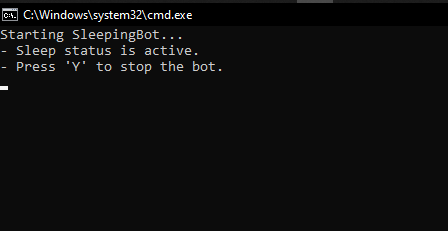

# 💤 SleepingDiscordRPC


A simple Node.js app that updates your Discord Rich Presence to show a custom "sleeping" status.

## ✨ Features

- 💤 Custom Discord Rich Presence
- ⚙️ Lightweight & easy to run
- 🎯 Useful for AFK or Do Not Disturb signals


## 📦 How to install?

1. Clone the repo
   ```bash
   git clone https://github.com/habitchaos/SleepingDiscordRPC.git
   cd SleepingDiscordRPC

2. **Install Node.js (if you haven't already)**  
   - Go to: [https://nodejs.org/](https://nodejs.org/)  
   - Download and install the **LTS version** for your OS  
   - Verify it's installed by running:
     ```bash
     node -v
     npm -v
     ```
     Example output:
     ```
     v18.19.1
     9.2.0
     ```

## 📦 How to run the program?
## 1. Run using nodejs terminal
2. ```bash
   node sleepingbot.js

## 2. Run the batch file
   ```bash
   runsleepingbot.bat
```

## 🖼️ Screenshots

### ✅ CMD Output
Shows the bot running successfully:


---

### 🎧 Discord VC Status
Shows how it looks when you're in a voice chat:


---

### 💤 Discord Profile Status
This is how your status looks on your Discord profile:


## 📄 License
MIT License. See the LICENSE file for more information.
